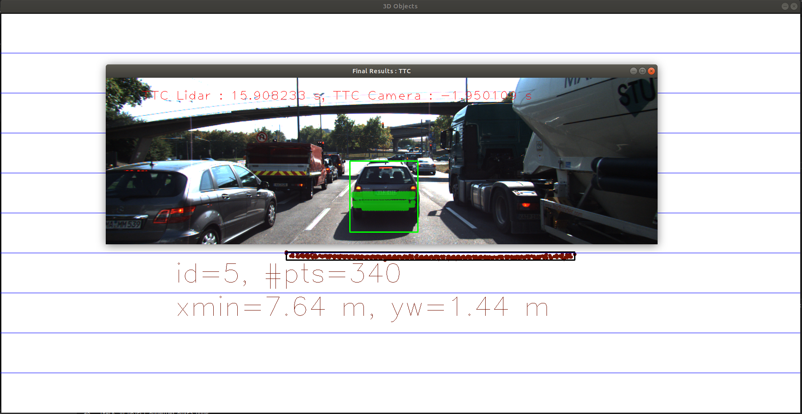

# SFND 3D Object Tracking

Welcome to the final project of the camera course. By completing all the lessons, you now have a solid understanding of keypoint detectors, descriptors, and methods to match them between successive images. Also, you know how to detect objects in an image using the YOLO deep-learning framework. And finally, you know how to associate regions in a camera image with Lidar points in 3D space. Let's take a look at our program schematic to see what we already have accomplished and what's still missing.

In this final project, you will implement the missing parts in the schematic. To do this, you will complete four major tasks: 
1. First, you will develop a way to match 3D objects over time by using keypoint correspondences. 
2. Second, you will compute the TTC based on Lidar measurements. 
3. You will then proceed to do the same using the camera, which requires to first associate keypoint matches to regions of interest and then to compute the TTC based on those matches. 
4. And lastly, you will conduct various tests with the framework. Your goal is to identify the most suitable detector/descriptor combination for TTC estimation and also to search for problems that can lead to faulty measurements by the camera or Lidar sensor. In the last course of this Nanodegree, you will learn about the Kalman filter, which is a great way to combine the two independent TTC measurements into an improved version which is much more reliable than a single sensor alone can be. But before we think about such things, let us focus on your final project in the camera course. 

## Dependencies for Running Locally
* cmake >= 2.8
  * All OSes: [click here for installation instructions](https://cmake.org/install/)
* make >= 4.1 (Linux, Mac), 3.81 (Windows)
  * Linux: make is installed by default on most Linux distros
  * Mac: [install Xcode command line tools to get make](https://developer.apple.com/xcode/features/)
  * Windows: [Click here for installation instructions](http://gnuwin32.sourceforge.net/packages/make.htm)
* Git LFS
  * Weight files are handled using [LFS](https://git-lfs.github.com/)
* OpenCV >= 4.1
  * This must be compiled from source using the `-D OPENCV_ENABLE_NONFREE=ON` cmake flag for testing the SIFT and SURF detectors.
  * The OpenCV 4.1.0 source code can be found [here](https://github.com/opencv/opencv/tree/4.1.0)
* gcc/g++ >= 5.4
  * Linux: gcc / g++ is installed by default on most Linux distros
  * Mac: same deal as make - [install Xcode command line tools](https://developer.apple.com/xcode/features/)
  * Windows: recommend using [MinGW](http://www.mingw.org/)

## Basic Build Instructions

1. Clone this repo.
2. Make a build directory in the top level project directory: `mkdir build && cd build`
3. Compile: `cmake .. && make`
4. Run it: `./3D_object_tracking`.

# FP.0 Write-Up Report

## FP.1 : Match 3D Objects

Bounding Boxes were matched based on highest number of keypoint correspondings. This was computed in an algorithmically-efficient way by a 2D Map `map<int, map<int, int>> boxMatchings` that stores for each pair of Bounding Boxes the number of keypoint matchings, then for each Bounding Box the Box with highest number of matches is selected as a match. This is implemented in function `matchBoundingBoxes` in file `camFusion_Student.cpp` lines 191-226.

## FP.2 : Compute lidar-Based TTC

To eliminate the effect of outlier lidar points, I calculated distance with respect to the median x-axis value of the points (This works because a very high number of points is focused and close to the actual end that we calculate the distance to, thus the median must be one of them). 
This is implemented in function `computeTTCLidar` and `medianXAxis` in file `camFusion_Student.cpp` lines 175-188.

## FP.3 : Associate Keypoint Correspondences with Bounding Boxes

For all keypoint matches, I check if it lies within the region of interest (roi) of the bounding box and if so it is added to the keypoints of that bounding box. 
This is implemented in function `clusterKptMatchesWithROI` in file `camFusion_Student.cpp` lines 134-140.

## FP.4 : Compute Camera-based TTC

Inspired by the lesson example, I iterated through each pair of points (> a given distance) and their corresponding matched points, euxlidean distance is calculated and then the ratio between current and previous distance. Distance ratios are added to a vector and their median is used in TTC computation.
This is implemented in function `computeTTCCamera` in file `camFusion_Student.cpp` lines 144-172.

## FP.5 Performance Evaluation 1

In all frames, I believe the Lidar-based TTC Estimation was reasonable (9.0~15.0 sec). I believe this is due to the median point being a stable and accuarate distance estimator.

## FP.6 Performance Evaluation 2
